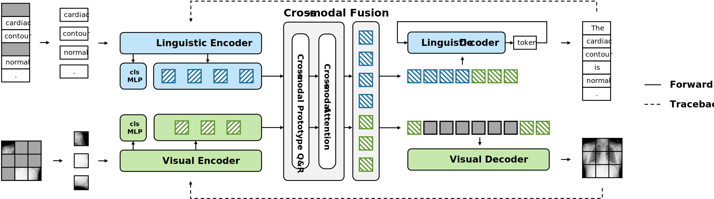
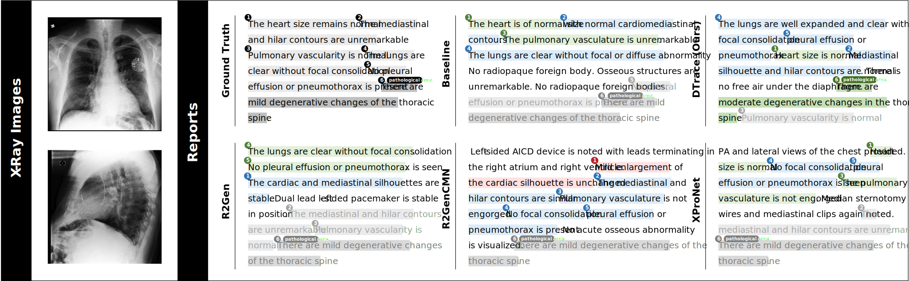
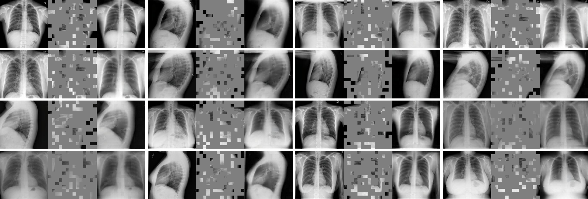
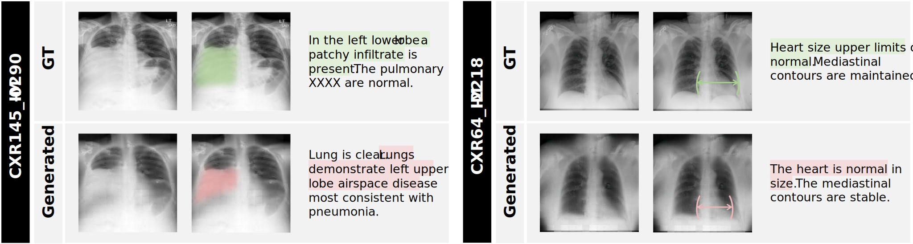

<div align="center">
<h1>ProLearn: Alleviating Textual Reliance in Medical Language-guided Segmentation via Prototype-driven Semantic Approximation</h1>

<a href="https://arxiv.org/pdf/2401.13267" target="_blank" rel="noopener noreferrer">
  
</a>
<a href="https://arxiv.org/abs/2401.13267"></a>
<a href="https://shuchangye-bib.github.io/websites/DTrace/dtrace.html"></a>

**[The University of Sydney](https://www.sydney.edu.au)**; **[Macquarie University](https://www.mq.edu.au)**

[Shuchang Ye](https://shuchangye-bib.github.io), [Mingyuan Meng](https://mungomeng.github.io), [Mingjian Li](https://tzcskys.netlify.app), [Dagan Feng](https://scholar.google.com/citations?user=89py58oAAAAJ), [Usman Naseem](https://researchers.mq.edu.au/en/persons/usman-naseem), [Jinman Kim](https://www.sydney.edu.au/engineering/about/our-people/academic-staff/jinman-kim.html)
</div>

## 🚀 Overview

DTrace solves fundamental limitations of existing medical report generation methods by ensuring that generated reports are both semantically faithful and visually grounded.

🔍 Why do current report generators fall short?

📝 They often overlook subtle but clinically important findings, producing generic or templated sentences that miss key diagnostic details.

📝 They frequently rely on statistical regularities in text rather than grounding outputs in the actual medical images, leading to clinically unreliable reports.

🧠 DTrace addresses these challenges through 1) Bi-directional generation, 2)Traceback supervision, and 3) Dynamic learning with variable image–text masking.




---

## 📉 State-of-the-art performance in disease discovery

DTrace addresses the limitations of existing encoder–decoder frameworks by reliably capturing critical diagnostic details that are often overlooked.



In addition, DTrace demonstrates strong capabilities in image reconstruction. Even when reconstructing from images with 75% of pixels masked, DTrace produces cohesive and semantically faithful outputs that preserve both morphological and clinical consistency.



---

## 🔬 Interpretability Analysis

To investigate how reconstructed images influence textual outputs, we conducted an interpretability analysis that reveals the close association between visual semantics and generated reports. These examples highlight that reconstructed images serve as a transparent window into DTrace’s decision-making process, showcasing both its strength in capturing nuanced clinical semantics and the challenges that arise when visual cues are not faithfully preserved.



---

## Quick Start

First, clone this repository to your local machine and install the dependencies. 

```bash
git clone git@github.com:ShuchangYe-bib/DTrace.git
cd DTrace
conda create --name dtrace python=3.11
conda activate dtrace
pip install -r requirements.txt
python -m nltk.downloader punkt_tab
```

Then, download pre-trained weights from [MAE](https://github.com/facebookresearch/mae)

```bash
bash download_weights.sh
```

Now, train and try the model with just a few lines of code:

```bash
python3 train.py
python3 inference.py
```

---

## License
This project is licensed under the MIT License - see the [LICENSE](LICENSE) file for details.

## 📚 Citation

If you find ProLearn useful in your research, please consider citing:

```bibtex
@article{ye2024dtrace,
  title={Dynamic Traceback Learning for Medical Report Generation},
  author={Ye, Shuchang and Meng, Mingyuan and Li, Mingjian and Feng, Dagan and Naseem, Usman and Kim, Jinman},
  journal={arXiv preprint arXiv:2401.13267},
  year={2024}
}
```


